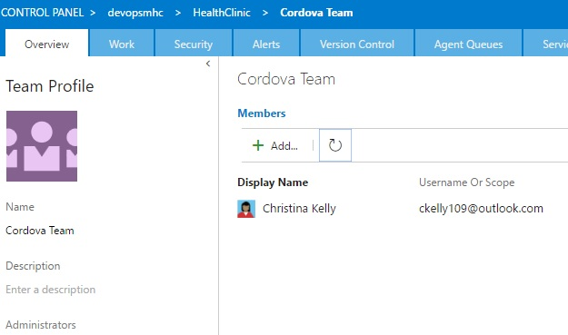
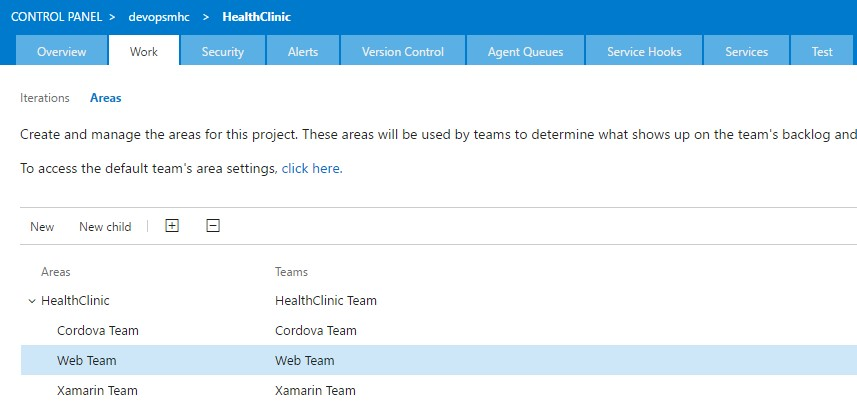
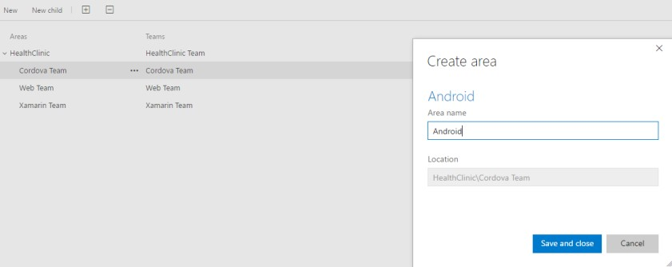
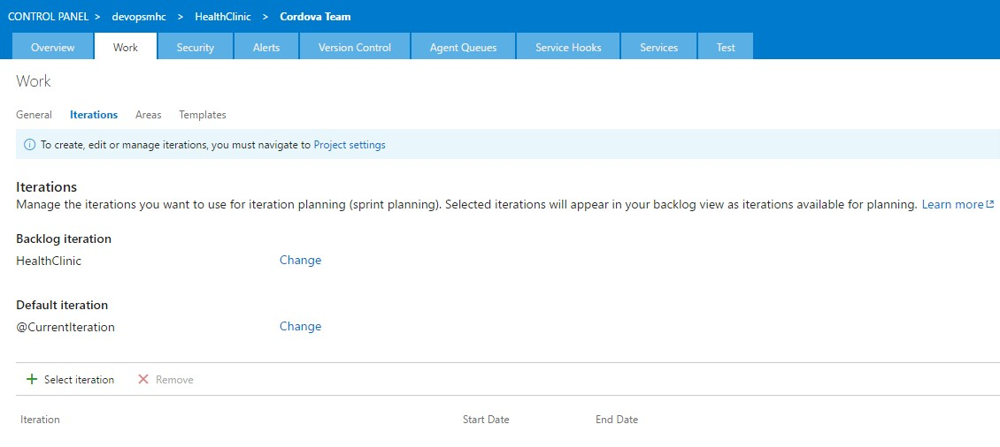
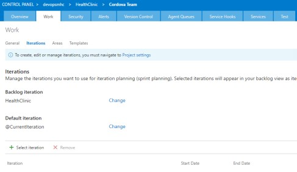
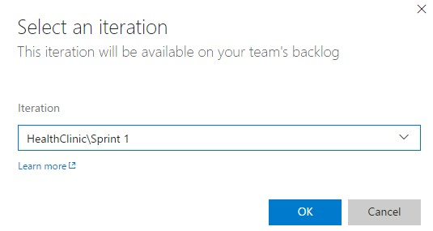
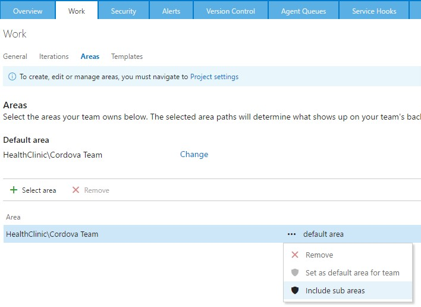

# TEAMS, AREAS AND ITERATIONS

1.	Connect to the `HealthClinic` VSTS project.	

    > Let´s see how to organize the three existing agile teams to work in the same project but with autonomy.

    > It´s very important for the company to be able to work with VSTS, Scrum and manage different teams that share the same backlog.

    

1.	Navigate to the administration overview page by choosing the Settings Icon gear icon in the top right.	

    > Let´s go the administration page to see how we can create different teams.

    

1.	Click in the upper link with the VSTS Project name.

1.	Check the existing teams, there is initially only one Team HealthClinic Team.	

    > The default team has the name of your VSTS project.

    > Here we will create the new teams and assign developers to the teams.

    

1.	Click on New Team to get the team creation screen.

    > With this steps we created a new `Cordova Team` team.

    > Repeat this step for the Teams `Xamarin Team` and `Web Team`.

    > This is important to keep the work and the views separated from different teams, allowing each team to be able to access and see only the information relevant to them.

1.	Name the new Team as `Cordova Team` and leave the rest of the fields with its default values.

    

1.	Click Create team button.	

1.	In the Overview screen for the newly created team we see our user as the only current member.

    > Having this organization, you can also add/assign administrators for every team – administrators for team can add additional team admins and members and also configure their team settings and manage the Agile tools and team assets.

    

    

1.	Click Add… button to add new members to this team.	

1.	Click again on the upper part on the name of the VSTS Project to go to main settings again.

    > Here you have the listing of existing areas already created for the teams.	

    > We are going to create new areas for the teams, so they will be able to divide their own work, and see only stories related to their own.

    > Areas are an important part of dividing work, as they allow to organize and divide the work not only for different teams, but for inside a team, being able to see the work for each part of the system the team is working on.

1.	Click on the `Work` panel.

1.	Click on `Areas`. 

    

1.	Select the Cordova Team node and click in New child.

    > In this step we created several areas for each one of the teams.

    > We will select later the scope of areas for each team.

1.	Give the new area a name, i.e.: `Android`.

    

1.	Click Save and close.

1.	Repeat the same steps creating new areas for this team and the rest of the teams.	

    > Next we proceed to review iterations.

1.	Click on `Iterations`.

    > As you see, there are already some iterations created within the project by default.

    > Here you are able to create more or delete the ones you don’t need.

    > Iterations are the Sprints we use in Scrum, and it is where we will assign our Sprint Backlog during the planning.

    > Also it will be what we will be updating in a daily basis with the daily scrums.

1.	Click on `New child` to create new iterations.	

    

1.	Click `Overview`.

    > Next step is assigning which Areas and Iterations each team is going to work with, so their backlog and sprints are shown correctly.

    > As you can see, initially, the Cordova Team has no iteration selected.

    > Assigning iterations to teams is necessary as they will use these iterations to plan their Sprint Backlogs so they can assign Product Backlog Items to the iteration they will be working in.

1.	Click on `Cordova Team`.

1.	Click on the `Work` panel.

    

1.	Click on `Iterations`.	

    > As said before the Cordova team members only will have access to the workitems assigned to sprints that assigned to their team.

    > So take care in this steps to assign to the corresponding teams only the iterations they will be working on.

    

1.	Click on `Select iteration`.

1.	Select `Sprint 1`.

1.	Click Ok.

1.	Select several iterations for this team.

1.	Click on `Change` for the Default Iteration.

    > We changed also the Default Iteration under new Items will be created by default, so they belong to the Product Backlog and not any iteration in particular.

    

1.	Select `HealthClinic` iteration as the default.

1.	Repeat from step 18th and do the same for the different teams with different sprints.	

1.	Click on `Areas`.

    > As with iterations, VSTS have areas which can be used to organize the work for the teams.

    > On Team creation, it creates a parent area for it.

    > Previously you created child areas for the teams, but they must be assigned to the Teams to be shown for their Backlogs.

1.	We see the main Cordova Team area.

1.	Put the cursor in the area at the left of the `default area` text, you will see an ellipsis.

1.	Click on the ellipsis and select `Include sub-areas`.	

    > This step ins necessary so teams can use all the sub-areas they need to organize it works, and assign Work Items to them. With this actions we ensure all this work items will appear on their backlogs.

    

