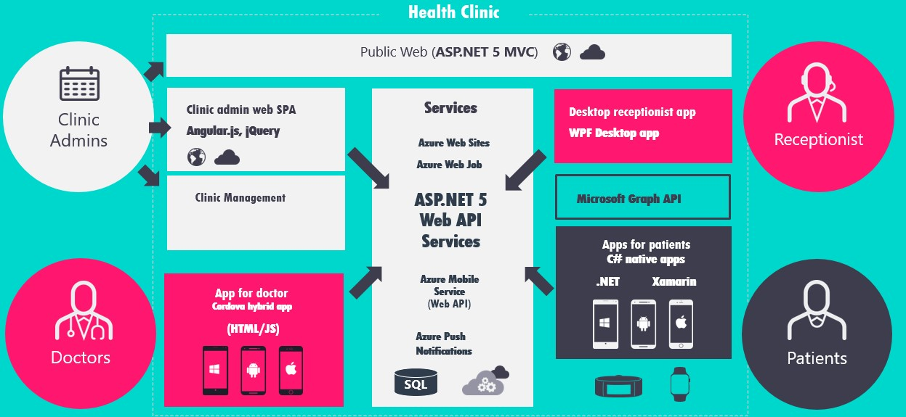
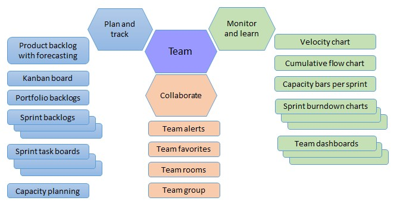

# OVERVIEW

This DevOps Inmersion experience is based on a fictional company named My Health Clinic, regular doctor practice specialized in offering healthcare preventive care,  which is creating a new application HealthClinic.biz. This clinic uses Microsoft technologies to grow their business and modernize their customer experience. They innovate and offer multiple apps and services that empower their patient’s well-being with easy access to manage their healthcare data and stay healthy.

## Public website

My HealthClinic offers a modern public-facing  website with information about tools, services, and integration with insurance companies. 
Technologies used: ASP.NET MVC, ES6, SASS, Gulp, bower, Azure WebApp..

## Native mobile apps

They also provide specialized apps for Doctors, and can manage medical appointments and treatments, history.
Technologies used: C# cross-platform and Xamarin. iOS and Android support.

## Hybrid mobile apps 

To manage patients, visits, medical history, and treatments.
Technologies used: Cordova, HTML/JavaScript, Visual Studio Tools for Apache Cordova. Cordova was selected just for demonstration purpose.

## Azure Services

HealthClinic uses a cloud-first strategy where Microsoft Azure is a key ingredient of this approach.
All the backend services are hosted on Azure and use several services as Azure App Service, Azure Mobile App, SQL Databases, Azure Push Notifications or Single-Sign-On with Azure Active Directory. 
The development team also uses Microsoft Azure for their dev-test environments using Azure ARM templates to provision new enviroments.

## Development Team

As HealthClinic organization grows, they will want to make sure that they configure the Agile tools to support that growth. To enable each feature team the autonomy it needs to manage their backlog and plan their sprints, they need their own set of team tools.
HealthClinic has three different agile teams working in the same project, with the same goals, but they need a tooling that allows them to work in an agile environment with autonomy.

The My Health Company teams uses Scrum as their framework for the software development process.

## Scrum

Scrum is a management and control process that cuts through complexity to focus on building software that meets business needs. Management and teams are able to get their hands around the requirements and technologies, never let go, and deliver working software, incrementally and empirically.  

Scrum itself is a simple framework for effective team collaboration on complex software projects.  Ken Schwaber and Jeff Sutherland have written The Scrum Guide to explain Scrum clearly and succinctly.
Yoou can read more about Scrum in the Scrum Guide: http://www.scrumguides.org/scrum-guide.html 
In the next chapter we resume the main Scrum events.

## Scrum Events

### The Sprint
The heart of Scrum is a Sprint, a time-box of one month or less during which a “Done”, useable, and potentially releasable product Increment is created. Sprints best have consistent durations throughout a development effort. A new Sprint starts immediately after the conclusion of the previous Sprint.
Sprints contain and consist of the Sprint Planning, Daily Scrums, the development work, the Sprint Review, and the Sprint Retrospective.

### Sprint Planning

The work to be performed in the Sprint is planned at the Sprint Planning. This plan is created by the collaborative work of the entire Scrum Team.
Sprint Planning is time-boxed to a maximum of eight hours for a one-month Sprint. For shorter Sprints, the event is usually shorter. The Scrum Master ensures that the event takes place and that attendants understand its purpose. The Scrum Master teaches the Scrum Team to keep it within the time-box.

### Daily Scrum

The Daily Scrum is a 15-minute time-boxed event for the Development Team to synchronize activities and create a plan for the next 24 hours. This is done by inspecting the work since the last Daily Scrum and forecasting the work that could be done before the next one. The Daily Scrum is held at the same time and place each day to reduce complexity. During the meeting, the Development Team members explain:
- What did I do yesterday that helped the Development Team meet the Sprint Goal?
- What will I do today to help the Development Team meet the Sprint Goal?
- Do I see any impediment that prevents me or the Development Team from meeting the Sprint Goal?

### Sprint Review

A Sprint Review is held at the end of the Sprint to inspect the Increment and adapt the Product Backlog if needed. During the Sprint Review, the Scrum Team and stakeholders collaborate about what was done in the Sprint. Based on that and any changes to the Product Backlog during the Sprint, attendees collaborate on the next things that could be done to optimize value. This is an informal meeting, not a status meeting, and the presentation of the Increment is intended to elicit feedback and foster collaboration.
This is a four-hour time-boxed meeting for one-month Sprints. For shorter Sprints, the event is usually shorter. The Scrum Master ensures that the event takes place and that attendants understand its purpose. The Scrum Master teaches all to keep it within the time-box.

### Sprint Retrospective

The Sprint Retrospective is an opportunity for the Scrum Team to inspect itself and create a plan for improvements to be enacted during the next Sprint.

The Sprint Retrospective occurs after the Sprint Review and prior to the next Sprint Planning. This is a three-hour time-boxed meeting for one-month Sprints. For shorter Sprints, the event is usually shorter. The Scrum Master ensures that the event takes place and that attendants understand its purpose. The Scrum Master teaches all to keep it within the time-box. The Scrum Master participates as a peer team member in the meeting from the accountability over the Scrum process.
