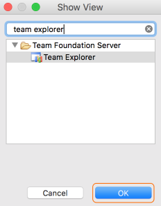
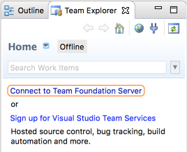
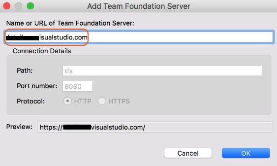
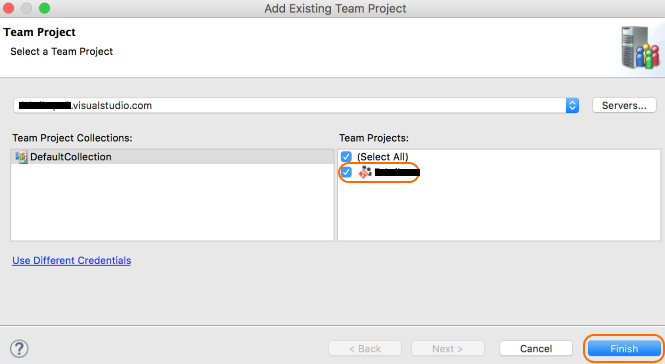

# TEAM EXPLORER EVERYWHERE 

Team Explorer Everywhere is an open-source Eclipse plug-in to connect Eclipse to Team Services or Team Foundation Server. 

If you're working with Team Services and Eclipse, you should use this plugin to connect to your your Team Services repos, builds, and work items.

## Install the Team Explorer Everywhere plug-in.

    > http://java.visualstudio.com/docs/tools/eclipse#_install-the-tee-plugin-for-eclipse 

## Add the Team Explorer Everywhere view in Eclipse. 

1. Go to Window>Show View.
1. Select Other... 
1. Search for Team Explorer.
1. Select the Team Explorer view.

    

1. Select OK.

## Connect to Team Services

1. In the Team Explorer Everywhere view, select Connect to Team Foundation Server .

    

1. Select Connect to Team Foundation Server to connect your VSTS account.

    > If your account isn't shown in the Add Existing Team Project window, select Servers and then select Add. Enter your Team Services account URL and select OK.

    

1. Add your account to Team Explorer Everywhere.

1. Select the team project where you will share your Eclipse project code.

    

1. Select Finish.

