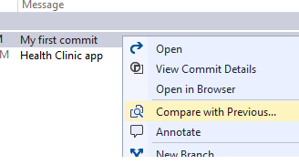
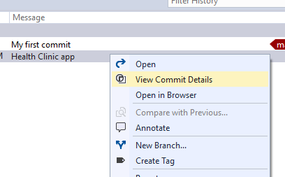
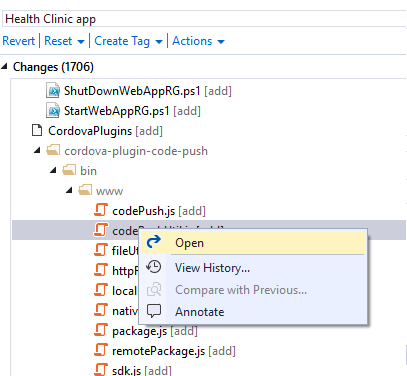

# REVIEW HISTORY

Git uses the parent reference information stored in each commit to manage a full history of your development. Review this commit history to find out when file changes were made and determine differences between versions of your code.

Git's use of feature branches and merges through pull requests mean that the commit history of your development doesn't form a straight, chronological line. When you use history to compare versions, think in terms of file changes between two commits instead of file changes between two points in time. A recent change to a file in the master branch may have come from a commit created two weeks ago in a feature branch but was only merged yesterday.

## Compare files

1. Open Visual Studio.	

1. Open up the Home view in Team Explorer.  

     

1. Open the `01_Demos_ASPNET5` solution.

1. Expand the MyHealth.API project.

1. Expand the controller folder.

1. Right-click the controller file that you modified before.

    

1. Choose View History.

    > The history window will appear showing the commit ID, author, date, and description of all changes to the file in your local repo across all branches.

1. Choose View History.

1. Right-clicking in the latest commit and choose Compare with previous. 

    

    

    > View the changes between any two versions by selecting both commits, then right-clicking and select Compare.

## Retrieve files

1. Right-click the controller file that you modified before.

1. Choose View History.

    >  You can filter the commits to find the exact commit with the file version you want to restore. 

1. Double click on the version to open it in Visual Studio.

1. Right-click the commit containing the version of the file you want to restore.

    

1. Select View Commit Details.

1. Right click the file to restore in the Commit Details in Team Explorer.

    

1. Select Open.

    > Save the version to your project by selecting Save As... from the File menu. 

    > If you save the file in your current project, either as a new file or overwriting an existing one, you'll need to commit your changes to add the previous version to your local branch.

