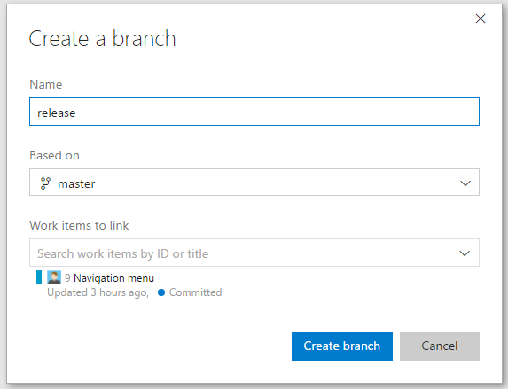
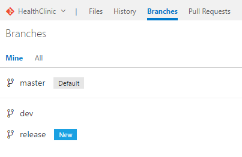
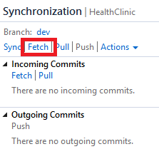
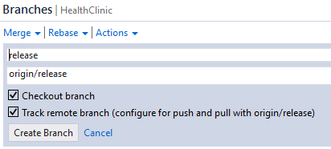
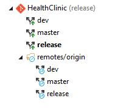
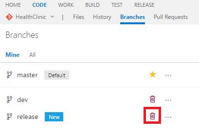
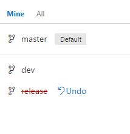
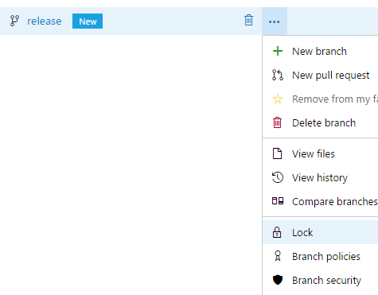

# MANAGE BRANCHES FROM THE TEAM SERVICES PORTAL

## Create a new branch

1. Sign in to your Visual Studio Team Services account.

1. From your account overview page, select your team project.

1. Select Code.

1. Open the Branches tab for your repo.

    

1. Select the New branch button in the upper right corner of the page.

    

1. In the Create a branch dialog, enter a name for your new branch.
1. Select a branch to base on.
1. Associate any work items.

    

1. Select Create branch.

1. Switch to Visual Studio.

    >  You will need to fetch the branch before you can swap to it in your local repo.

1. Open up Team Explorer.

1. Go to the Sync view.

    

1. Go to the Branches view.

    

1. Locate the remote branch you want to checkout in your local repository. 

1. Right-click the branch name.

1. Select New Local Brach From. 

    

    

1. Select Create Branch. 

    > The remote branch is already in your local repository.

    

## Delete a branch

1. Open the Branches view while viewing your repo on the web.

1. Locate your branch on the branches page. 

    > If you don't see it, select All to view all branches and filter the branches using the Search all branches box in the upper right.

    

1. Select the trashcan icon next to the branch you want to delete.

    > If you delete a branch by accident, you can undo the delete by selecting Undo next to the branch name.

    

## Lock a branch

Locking is ideal for preventing new changes that might conflict with an important merge or to place a branch into a read-only state. 
Use branch policies and pull requests instead of locking if you just want to ensure that changes in a branch are reviewed before they are merged.

Locking does not prevent cloning of a repo or fetching updates made in the branch into your local repo. 
Share with your team the reason for the locking of the branch and make sure your team knows what to do to work with the branch after it is unlocked.

1. Open the Branches view while viewing your repo on the web.

1. Locate your branch on the branches page. 

1. Lock the branch by selecting the ... icon next to the branch name and then selecting Lock from the menu. 

    > A lock icon will appear next to the branch name. Unlock a locked branch by selecting Unlock from the same menu.

    

