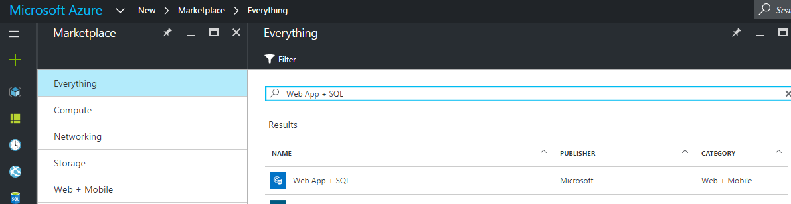
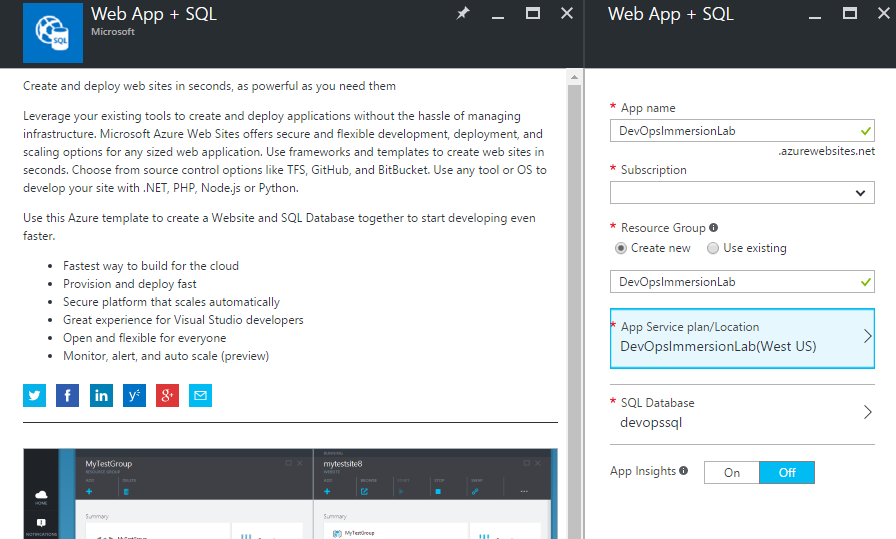
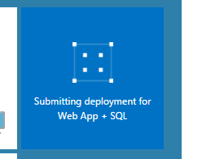
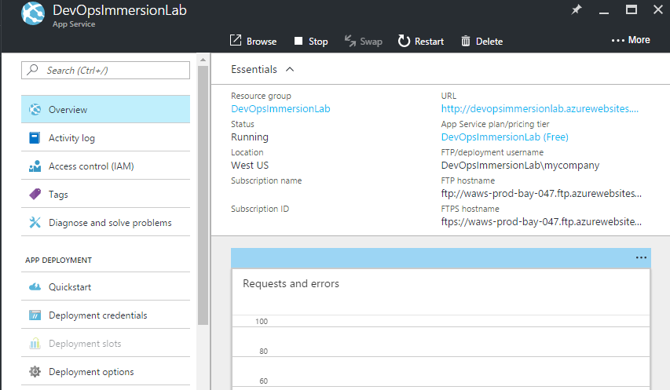

# CREATE AN EMPTY WEB APP

Le´ts create an empty Azure web app in your Azure subscription to deploy the HealthClinic ASP.NET core application.

1.	Open the Azure portal.

1.	Add a new Azure Resource: Web App + SQL.

    

1. Add the webapp name, pricing tier (free), resource group name and database name.

    

1. Click Pin to dashboard.
1. Click Create.

    

    

1. After few seconds the empty Web app will be created.

    

1. Click on the Web App URL. 

    > It´s empty so let´s go to deploy the HealthClinic app.

    

